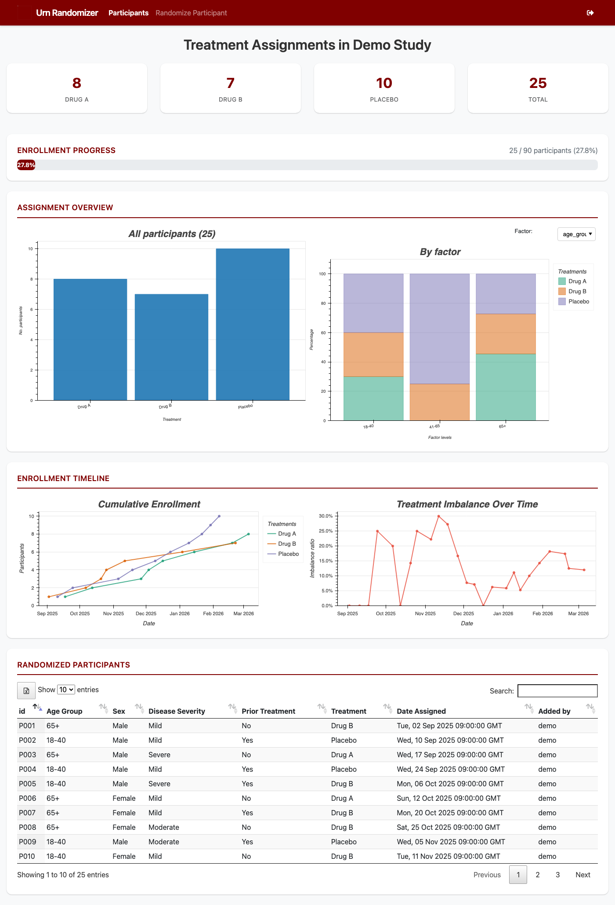

Urn Randomizer
==============

.. image:: https://zenodo.org/badge/DOI/10.5281/zenodo.19023651.svg
   :target: https://doi.org/10.5281/zenodo.19023651
   :alt: DOI

A clinical trial urn randomization system implementing the adaptive biased coin
design described by `Wei (1978) <https://doi.org/10.1214/aos/1176344068>`_.
The system ensures treatment-group balance according to one or more prognostic
factors and exposes its functionality through a **Flask web GUI**, a **REST API**,
and a **command-line interface**.

|

.. grid:: 3
   :gutter: 3

   .. grid-item-card:: Getting Started
      :link: quickstart
      :link-type: doc

      Install the package, configure a study, and run your first randomization.

   .. grid-item-card:: Web Dashboard
      :link: overview
      :link-type: doc

      Monitor enrollment progress, treatment balance, and assignment history
      through the interactive web interface.

   .. grid-item-card:: REST API
      :link: api
      :link-type: doc

      Integrate randomization into existing platforms using the HTTP API.

   .. grid-item-card:: Python API Examples
      :link: api-examples
      :link-type: doc

      Step-by-step Python examples for querying, randomizing, and batch operations.

   .. grid-item-card:: CLI Reference
      :link: cli
      :link-type: doc

      Manage users, randomize participants, and export data from the terminal.

   .. grid-item-card:: Plugin System
      :link: plugins
      :link-type: doc

      Customize assignment logic with Python plugins that run after each
      urn draw.

   .. grid-item-card:: Reproducibility
      :link: reproducibility
      :link-type: doc

      How seed management and the PCG64 generator ensure deterministic,
      auditable assignment sequences.

   .. grid-item-card:: Why Urn Randomization?
      :link: simulation-study
      :link-type: doc

      Monte Carlo evidence showing how urn randomization reduces treatment
      imbalance compared to complete randomization.

Key Features
------------

- **Urn randomization** per Wei (1978) adaptive biased coin design
- **Interactive dashboard** with enrollment progress, Bokeh charts, and data export
- **REST API** with API-key authentication for programmatic access
- **CLI** for scripting and batch operations
- **Plugin system** for custom assignment logic
- **Reproducible RNG** via NumPy PCG64 generator
- **SQLite storage** for portable, zero-configuration persistence

.. tip::

   Try the `live demo <https://py-urn-randomizer.onrender.com>`_ — no login
   required. The demo is pre-seeded with 25 participants across three treatment
   arms.

.. toctree::
   :maxdepth: 2
   :caption: User Guide
   :hidden:

   quickstart
   overview
   configuration
   plugins
   reproducibility
   simulation-study

.. toctree::
   :maxdepth: 2
   :caption: Reference
   :hidden:

   api
   api-examples
   cli

.. toctree::
   :maxdepth: 1
   :caption: Project
   :hidden:

   deployment
   changelog
   glossary
