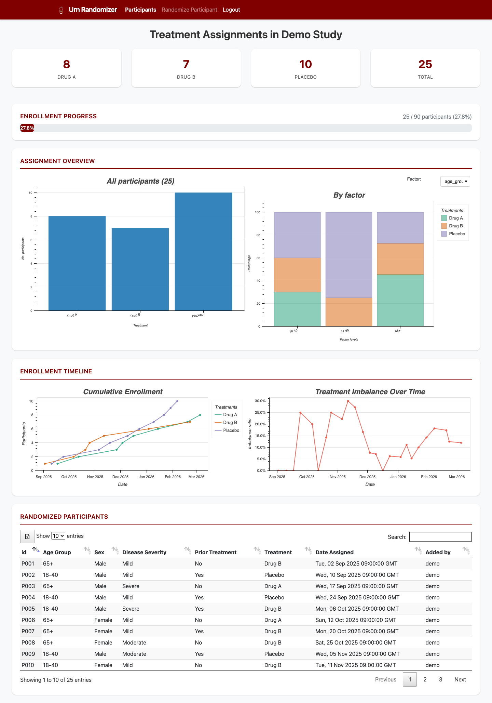
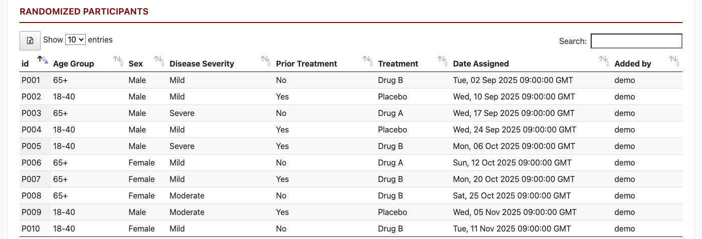
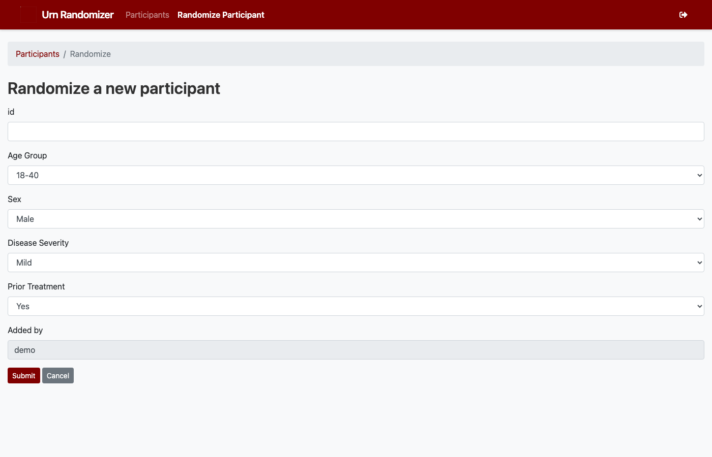
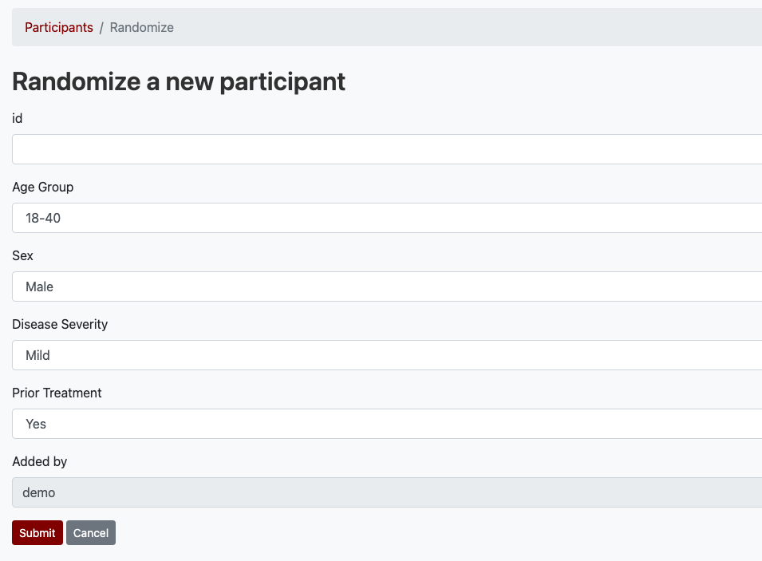

Web Dashboard
=============

The web interface provides a real-time view of your study's randomization
status. After logging in with your Google account, you are redirected to
the **Participants** dashboard.

Dashboard
---------

The dashboard is divided into several sections:

.. figure:: figures/screenshot_dashboard.png
   :alt: Full dashboard view
   :align: center
   :width: 90%

   The Participants dashboard showing all monitoring sections.

Summary Cards
^^^^^^^^^^^^^

At the top of the page, cards display the current count of participants
assigned to each treatment arm, plus the overall total. These update
automatically as new participants are randomized.

Enrollment Progress
^^^^^^^^^^^^^^^^^^^

When a ``target_enrollment`` is set in the configuration file, a progress
bar shows how enrollment is tracking against the target.

Assignment Overview
^^^^^^^^^^^^^^^^^^^

Two interactive Bokeh charts provide a visual breakdown:

- **All participants** — a bar chart showing treatment counts across all strata.
- **By factor** — a stacked bar chart that can be filtered by any prognostic
  factor using the dropdown selector.

   Treatment assignment counts across strata.

Enrollment Timeline
^^^^^^^^^^^^^^^^^^^

Two time-series charts show how the study has progressed:

- **Cumulative Enrollment** — a line per treatment arm showing the running
  total of assignments over time.
- **Treatment Imbalance Over Time** — the ratio of participants in each arm,
  helping identify drift from balance.

Participant Table
^^^^^^^^^^^^^^^^^

A searchable, sortable DataTable lists every randomized participant with their
factor levels, assigned treatment, and timestamp. Use the Excel button to
export the full dataset.

   The participant table with factor levels, treatment, and timestamps.

Randomizing a Participant
-------------------------

Click **Randomize Participant** in the navigation bar. Fill in the participant
ID and select the appropriate level for each prognostic factor, then click
**Submit**.

   Enter factor levels and submit to receive a treatment assignment.

   A completed form showing the treatment assignment result.

The assigned treatment arm is displayed as a flash message at the top of the
page, and the participant appears immediately in the dashboard table.

Authentication
--------------

Authentication to the web interface is handled via **OAuth 2.0 with Google**.
Users log in with their Google account. An administrator must register each
user's email address beforehand using the CLI:

.. code-block:: bash

   flask add_user johndoe john@example.com
