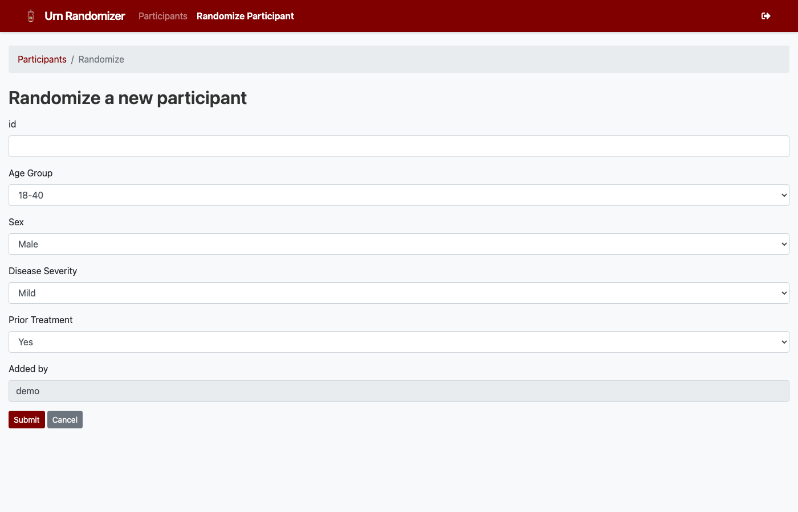

Quick Start
===========

Prerequisites
-------------

- Python 3.12 or later
- A Google OAuth 2.0 client ID and secret (for authentication)

Installation
------------

.. code-block:: bash

   git clone https://github.com/TavoloPerUno/py_urn_randomizer.git
   cd py_urn_randomizer
   python -m venv venv
   source venv/bin/activate    # Windows: venv\Scripts\activate
   pip install -r requirements.txt

Configuration
-------------

Copy the sample configuration and edit it for your study:

.. code-block:: bash

   cp config-sample.yaml config.yaml

See :doc:`configuration` for a full reference of available settings.

You also need to set environment variables for Flask. Copy the example:

.. code-block:: bash

   cp example.env .env
   # Edit .env with your Google OAuth credentials and secret key

Database Setup
--------------

Initialize the database and create your first user:

.. code-block:: bash

   flask createdb
   flask add_user admin admin@example.com

The ``add_user`` command prints an API key for the new user. Store this
securely — it is required for REST API access.

Running the Server
------------------

.. code-block:: bash

   flask run

Open http://localhost:5000 in your browser and log in with your Google account.

Your First Randomization
-------------------------

From the web interface, click **Randomize Participant** in the navigation bar.
Enter a participant ID, select the appropriate prognostic factor levels, and
click **Submit**. The assigned treatment arm is displayed immediately.

   The randomization form with factor selection fields.

Alternatively, use the CLI:

.. code-block:: bash

   urn -s "My Study" randomize --id P001 --user admin

Or the REST API:

.. code-block:: bash

   curl -X POST "http://localhost:5000/study_participants?\
   api_key=YOUR_KEY&study=My+Study&id=P001&age_group=18-40&sex=Male"
